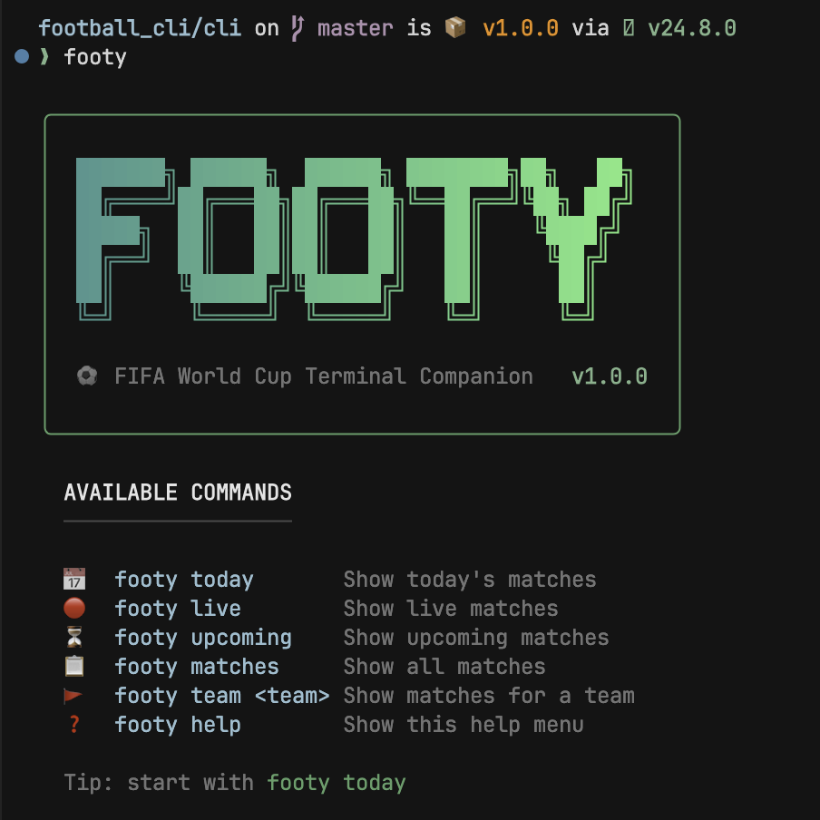
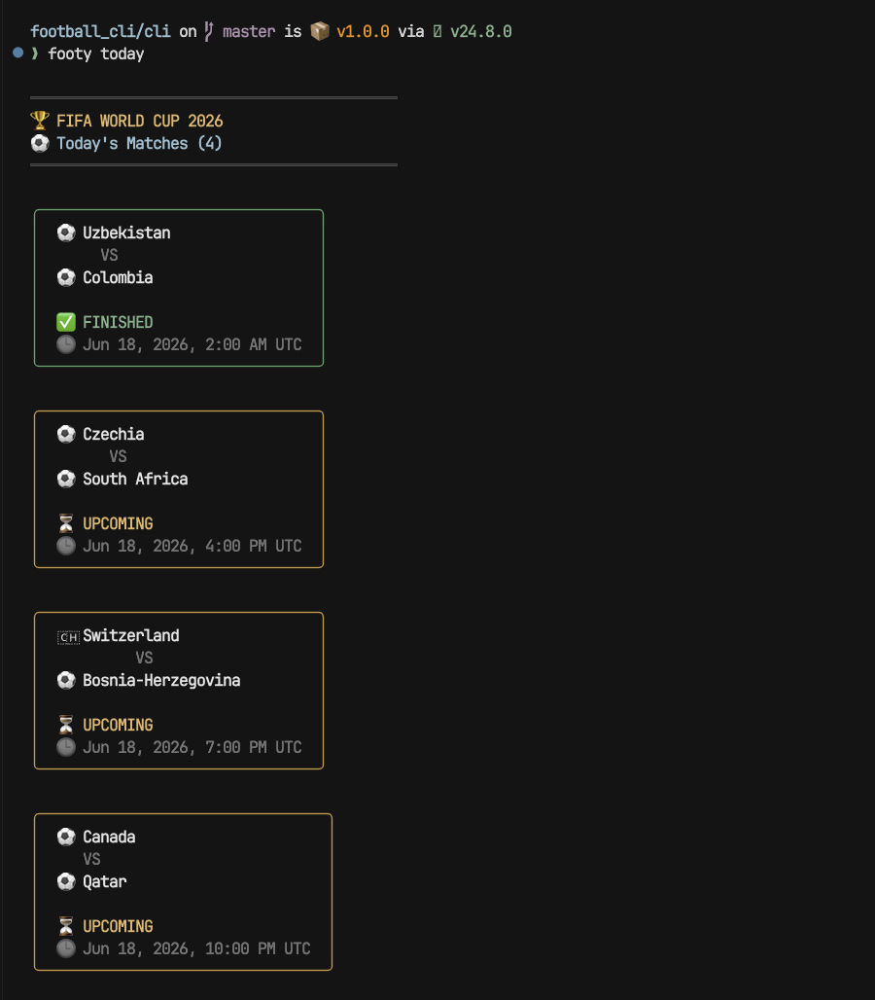
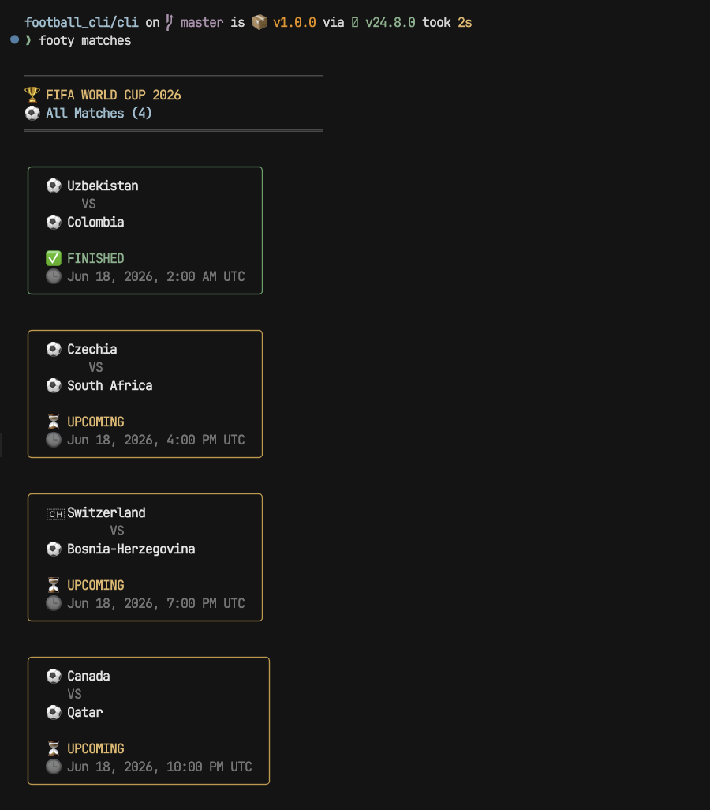
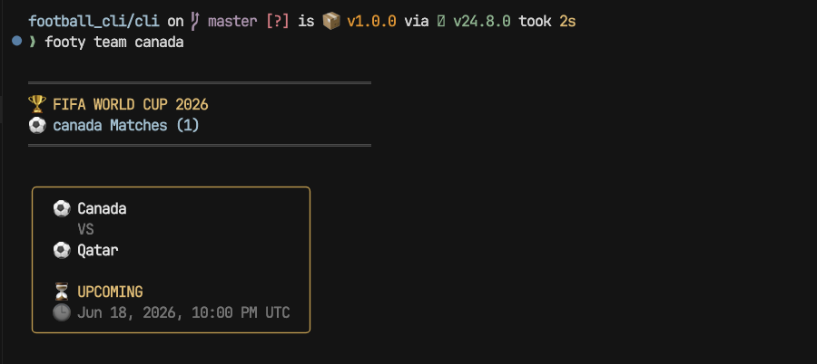

<div align="center">

# 🏆 Footy

### FIFA World Cup 2026 Terminal Companion

**Live scores, today's fixtures, upcoming matches and team schedules — beautifully rendered right inside your terminal.**

Footy is a global command-line companion for the **FIFA World Cup 2026**. Type `footy today`, `footy live`, or `footy team Portugal` and get clean, color-coded, broadcast-style match cards without ever leaving your shell. It is powered by a dedicated Node.js + Express backend that wraps a third-party football data API, transforms the raw payloads into a tidy shape, and serves them to a lightweight, lovingly-styled CLI client.

<br/>


</div>

---

## 📖 Table of Contents

- [About Footy](#-about-footy)
- [Screenshots](#-screenshots)
- [Features](#-features)
- [Demo](#-demo)
- [Architecture](#-architecture)
- [Project Structure](#-project-structure)
- [Engineering Concepts Demonstrated](#-engineering-concepts-demonstrated)
- [Commands](#-commands)
- [Getting Started](#-getting-started)
- [Design Decisions](#-design-decisions)
- [Future Roadmap](#-future-roadmap)
- [About The Project](#-about-the-project)

---

## ⚽ About Footy

Following a tournament as massive as the World Cup usually means juggling tabs, apps, and notifications. **Footy** flips that around: it brings the matches *to* the place developers already live — the terminal.

Under the hood, Footy is a small but deliberately-structured **monorepo** split into two clear halves:

- A **backend** (Node.js + Express) that owns all the messy work — calling the external football API, validating environment configuration, normalizing inconsistent fields, filtering by status/team/date, and exposing a small, predictable REST surface.
- A **CLI** (Node.js) that owns the experience — turning that clean JSON into FIFA-branded cards with country flags, status-aware colors, rounded boxes, and a polished help screen.

The result is a tool that *looks* like a finished product and *reads* like production code: separation of concerns, reusable helpers, centralized theming, and graceful error handling throughout.

---

## 📸 Screenshots

> Screenshots live under [`docs/screenshots`](docs/screenshots). More views will be added over time.

### Help Screen — `footy` / `footy help`

A FIFA-themed splash banner (rendered with `figlet` + a pitch-inspired teal→green gradient) followed by a clean, icon-led command reference. This is the front door of the app.



### Today's Matches — `footy today`

Every fixture kicking off today, sorted by kickoff time and rendered as individual scoreboard cards. Each card highlights the two nations, a **status badge** (`FINISHED`, `UPCOMING`, `LIVE NOW`), and the UTC kickoff time.



### All Matches — `footy matches`

The full match list for the tournament window in the same broadcast-style card layout, with a branded header summarizing the total count.



### Team Matches — `footy team <team-name>`

Filter the schedule down to a single nation. Footy fetches only that team's fixtures and falls back to a friendly empty state when there's nothing to show.



> 🔴 **Live view** (`footy live`) renders an additional **"LIVE NOW" spotlight** above the cards. A screenshot will be added at `docs/screenshots/live.png`.

---

## ✨ Features

| | Feature | Description |
| :-: | :--- | :--- |
| 📅 | **Today's matches** | View all fixtures kicking off today, sorted by kickoff time. |
| 🔴 | **Live matches** | See in-play matches with a dedicated "LIVE NOW" spotlight banner. |
| ⏳ | **Upcoming matches** | Browse all scheduled fixtures that haven't started yet. |
| 🚩 | **Search by team** | Filter the schedule down to a single nation (`footy team Portugal`). |
| 🎨 | **Beautiful terminal UI** | Boxen cards, Chalk colors, gradients, and figlet ASCII branding. |
| 🏷️ | **Status-aware match cards** | Card color & badge adapt to match state (Live / Upcoming / Finished). |
| 🌍 | **Country flags** | Emoji flags mapped to participating nations for instant recognition. |
| 🏆 | **FIFA World Cup themed** | Consistent World Cup 2026 branding across every screen. |
| 🌐 | **Global CLI command** | Install once, run `footy` from anywhere on your machine. |
| ♻️ | **Reusable backend architecture** | Clean service/controller/route layering on the server. |
| 🛡️ | **Error handling & graceful fallbacks** | Friendly empty states and error messages — never raw stack traces. |

---

## 🎬 Demo

```bash
# Show the branded help / command menu
footy help

# Today's fixtures, sorted by kickoff
footy today

# In-play matches with a LIVE NOW spotlight
footy live

# Everything that's scheduled but hasn't started
footy upcoming

# Just one nation's schedule
footy team Portugal
```

<details>
<summary><b>Example output — <code>footy today</code></b></summary>

```text
═══════════════════════════════════════════
🏆 FIFA WORLD CUP 2026
⚽ Today's Matches (4)
═══════════════════════════════════════════

╭───────────────────────────────╮
│   🇺🇿 Uzbekistan                │
│        VS                       │
│   🇨🇴 Colombia                  │
│                                 │
│   ✅ FINISHED                   │
│   🕒 Jun 18, 2026, 2:00 AM UTC  │
╰───────────────────────────────╯

╭───────────────────────────────╮
│   🇨🇿 Czechia                   │
│        VS                       │
│   🇿🇦 South Africa              │
│                                 │
│   ⏳ UPCOMING                   │
│   🕒 Jun 18, 2026, 4:00 PM UTC  │
╰───────────────────────────────╯
```

</details>

<details>
<summary><b>Example output — <code>footy team Canada</code></b></summary>

```text
═══════════════════════════════════════════
🏆 FIFA WORLD CUP 2026
⚽ Canada Matches (1)
═══════════════════════════════════════════

╭───────────────────────────────╮
│   🇨🇦 Canada                    │
│        VS                       │
│   🇶🇦 Qatar                     │
│                                 │
│   ⏳ UPCOMING                   │
│   🕒 Jun 18, 2026, 10:00 PM UTC │
╰───────────────────────────────╯
```

</details>

---

## 🏗️ Architecture

Footy intentionally puts a backend between the CLI and the third-party data provider:

```text
        ┌──────────────────┐
        │   Footy CLI      │   commander · chalk · boxen · figlet
        │  (terminal UX)   │   flags · status badges · cards
        └────────┬─────────┘
                 │  HTTP (GET /api/v1/matches/...)
                 ▼
        ┌──────────────────┐
        │  Footy Backend   │   Express · routes → controllers → services
        │  (Node + Express)│   filtering · sorting · data transformation
        └────────┬─────────┘
                 │  HTTPS (X-Auth-Token)
                 ▼
        ┌──────────────────┐
        │   Football API   │   football-data.org (third-party)
        └──────────────────┘
```

### Why a backend layer instead of calling the API directly from the CLI?

It would have been simpler to call `football-data.org` straight from the CLI — but a dedicated backend buys real, demonstrable engineering value:

- **🧩 Separation of concerns** — the CLI focuses purely on *presentation*; the backend owns *data access and shaping*. Neither side knows the other's internals.
- **♻️ Reusability** — the same `/api/v1/matches` endpoints can power any number of clients without duplicating filtering/formatting logic.
- **📈 Scalability** — caching, rate-limit handling, retries, and provider swaps can all be added in **one place** later without touching the CLI.
- **🖥️ Multiple client support** — a future web dashboard, mobile app, or editor extension could consume the exact same API.
- **🔐 Secret isolation** — the upstream API key stays server-side in environment variables; it is never bundled into a globally-installed CLI.

---

## 📁 Project Structure

```text
football_cli/
├── backend/                 # Node.js + Express API
│   ├── server.js            # Entry point — boots the HTTP server
│   └── src/
│       ├── app.js           # Express app, middleware & route mounting
│       ├── config/          # Env validation + axios football API client
│       ├── routes/          # /api/v1/matches route definitions
│       ├── controllers/     # Request/response handling per endpoint
│       ├── services/        # Data fetching, filtering & transformation
│       ├── middlewares/     # Centralized error handler
│       └── utils/           # asyncHandler, AppError helpers
│
├── cli/                     # Node.js global CLI ("footy")
│   └── src/
│       ├── index.js         # Command router + help screen (bin entry)
│       ├── commands/        # One module per command (today, live, ...)
│       ├── services/        # HTTP calls to the Footy backend
│       └── utils/           # banner, cards, flags, theme, status, messages
│
└── docs/
    └── screenshots/         # Terminal screenshots used in this README
```

| Folder | Responsibility |
| :--- | :--- |
| **`backend/`** | The data brain. Talks to the external API, validates config, transforms and filters matches, and exposes a clean REST interface. |
| **`cli/`** | The experience. Parses commands, calls the backend, and renders FIFA-branded, status-aware match cards in the terminal. |
| **`docs/`** | Documentation assets — primarily the screenshots embedded throughout this README. |

---

## 🧠 Engineering Concepts Demonstrated

This project is intentionally small in surface area but rich in patterns. It demonstrates:

- **REST API design** — versioned, resource-oriented endpoints under `/api/v1/matches` with sensible query parameters (`status`, `team`, `date`).
- **Service Layer Pattern** — all data access and business logic lives in `services/`, keeping controllers thin and testable.
- **Controller Layer** — controllers handle only the HTTP request/response lifecycle and delegate work to services.
- **CLI development** — a global, installable binary with command routing, argument parsing, and a polished help system.
- **Error handling** — a centralized Express error middleware, an `asyncHandler` wrapper to avoid repetitive try/catch, and consistent CLI error/empty states.
- **Data transformation** — raw, deeply-nested provider payloads are normalized into a flat, predictable shape (`homeTeam`, `awayTeam`, `status`, `kickoff`).
- **API integration** — a configured `axios` client with auth headers and isolated base URL configuration.
- **Terminal UI design** — Chalk colors, Boxen cards, figlet ASCII art, gradients, country flags, and status badges working together as a cohesive theme.
- **Modular architecture** — a clean monorepo split with single-responsibility files and reusable helpers on both client and server.

> 💼 **Resume-friendly summary:** *Designed and built a full-stack Node.js monorepo — a versioned Express REST API (route → controller → service layering, centralized error handling, third-party API integration with data normalization) consumed by a globally-installed CLI client featuring a themed, status-aware terminal UI.*

---

## 📟 Commands

| Command | Description |
| :--- | :--- |
| `footy` | Show the branded banner and command menu (same as `footy help`). |
| `footy help` | Show the help screen with all available commands. |
| `footy today` | Show all matches kicking off today, sorted by kickoff time. |
| `footy live` | Show currently in-play matches with a "LIVE NOW" spotlight. |
| `footy upcoming` | Show scheduled matches that haven't started yet. |
| `footy matches` | Show the full list of matches. |
| `footy team <team-name>` | Show matches for a specific nation (e.g. `footy team Portugal`). |

---

## 🚀 Getting Started

Footy is a monorepo: run the **backend** first (it serves the data), then install and link the **CLI**.

### Prerequisites

- **Node.js** (v18+ recommended)
- A free API key from [football-data.org](https://www.football-data.org/)

### 1. Backend

```bash
cd backend
npm install
```

Create a `.env` file inside `backend/`:

```env
PORT=3000
FOOTBALL_API_KEY=your_football_data_org_api_key
```

Then start the API in watch mode:

```bash
npm run dev
```

The backend will boot on `http://localhost:3000`. You can sanity-check it at `http://localhost:3000/health`.

### 2. CLI

In a second terminal:

```bash
cd cli
npm install
npm link
```

`npm link` registers `footy` as a global command on your machine.

### 3. Run it

With the backend running, use Footy from anywhere:

```bash
footy help
footy today
footy live
footy upcoming
footy team Portugal
```

> ℹ️ The CLI talks to the backend at `http://localhost:3000`, so keep the backend running while you use `footy`.

---

## 🧭 Design Decisions

<details>
<summary><b>Why does a backend exist at all?</b></summary>

<br/>

To keep the CLI dumb and the data logic smart. The backend isolates the third-party API (and its secret key), centralizes filtering/sorting/transformation, and exposes a stable contract any client can rely on. This trades a little extra setup (two processes instead of one) for a clean separation that scales — caching, retries, or a provider change happen server-side without ever touching the CLI.

</details>

<details>
<summary><b>Why does data formatting happen in the services?</b></summary>

<br/>

The external provider returns deeply-nested, verbose objects. The service layer is the single place that knows that shape — it maps everything down to a flat `{ homeTeam, awayTeam, status, kickoff }` model. Controllers and clients never have to understand the provider's schema, so a future API swap only touches one file.

</details>

<details>
<summary><b>Why does presentation happen in the commands?</b></summary>

<br/>

Each command module is responsible for one user-facing flow: fetch data, decide between a results view or an empty state, and hand off to the renderer. Keeping presentation out of the services means the *same* data can be displayed differently (or by a different client) without changing how it's fetched.

</details>

<details>
<summary><b>Why does the CLI use reusable helpers?</b></summary>

<br/>

Headers, match cards, flags, status badges, theming, and message states are all extracted into shared utilities (`utils/`). Every command renders through the same primitives, so the UI stays visually consistent and a styling tweak applies everywhere at once (DRY).

</details>

### Architectural tradeoffs

- **Two processes vs. one** — running a separate backend adds operational overhead, but it's what enables secret isolation, reusability, and multi-client support.
- **Network hop latency** — routing through the backend adds a local request, accepted in exchange for a clean separation and a natural home for a future caching layer.
- **Local-first defaults** — the CLI currently targets `http://localhost:3000`, which keeps setup simple for development; a configurable base URL is a natural next step.

---

## 🗺️ Future Roadmap

Ideas under consideration (not yet implemented):

- 🔔 **Match notifications** — desktop/terminal alerts for kickoff and key moments.
- ⚡ **Live score updates** — auto-refreshing scores for in-play matches.
- 🧩 **Cursor extension** — surface fixtures and scores directly inside the editor.
- 🤖 **AI-powered match summaries** — concise, generated recaps of finished games.
- ⭐ **Team watchlists** — follow favorite nations and see their fixtures first.
- 🗃️ **Caching layer** — reduce upstream calls and improve response times.
- 🏟️ **Multiple tournaments** — extend beyond the World Cup to leagues and cups.

---

## 💡 About The Project

Footy was built as a hands-on learning journey across the full stack of building a real developer tool. It was an exercise in:

- **Backend Development** — structuring an Express app with clean route/controller/service layering and centralized error handling.
- **CLI Engineering** — building a global, installable command-line tool with proper command routing and helpful UX.
- **API Design** — designing a small, versioned, resource-oriented REST surface meant to be consumed by multiple clients.
- **Product Thinking** — deciding what a World Cup companion *should* feel like and making deliberate scope and architecture tradeoffs.
- **Terminal UX** — treating the terminal as a first-class interface worthy of thoughtful color, layout, and branding.

<div align="center">

<br/>

**Built with ⚽ for the FIFA World Cup 2026.**

*If you find this project interesting, consider giving it a ⭐ — it helps a lot!*

</div>
